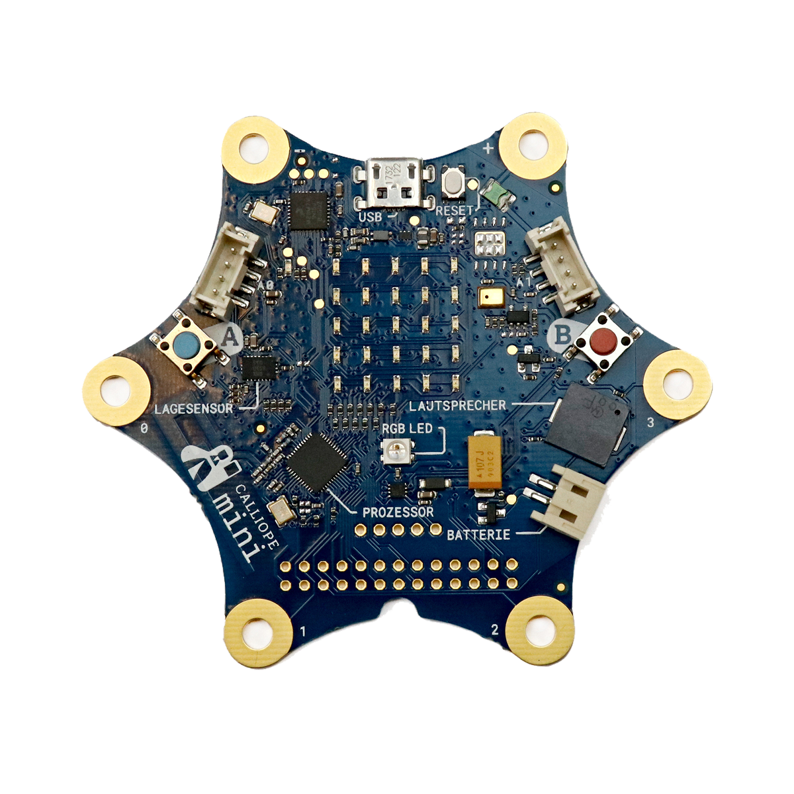

# Calliope mini

## Beschreibung
Der Calliope mini ist ein Mikrocontroller, der speziell für Bildungszwecke entwickelt wurde. Neben den grundlegenden Funktionen eines jeden Mikrocontrollers hat er bereits viele Sensoren und Aktoren, wie Lautsprecher und Leuchten, integriert. Dies ermöglicht es, schnell ohne zusätzliche Komponenten kleine Projekte umzusetzen und auszuprobieren.

Ein Mikrocontroller erlaubt es, prinzipiell jegliche Art von technischen Vorgängen automatisiert miteinander zu koordinieren. Dafür besitzt der Mikrocontroller sogenannte \[simple\_tooltip content='Die Mikrocontroller besitzen kleine metallische Kontakte, an die Komponenten, Shields oder andere Platinen angeschlossen werden können. Diese Kontakte werden Pins genannt und können oft als sogenannte GPIO’s (Allzweck Ein- und Ausgabe) eingesetzt werden. Dies bedeutet, dass diese Pins direkt über die Programmierung des Mikrocontrollers angesprochen werden können und hierbei sogar bestimmt werden kann, ob dieser Pin als Eingang (beispielsweise zum Auslesen eines Sensors) oder als Ausgang (beispielsweise zur Steuerung eines Motors) genutzt werden kann. Praktisches Beispiel: Wird am eine LED an Pin 1 angeschlossen, kann im Programm direkt der Pin 1 als „An“ oder „Aus“ definiert werden und damit die LED an- oder ausgeschaltet werden.' \]Ein- und Ausgänge (Inputs und Outputs)\[/simple\_tooltip\]. Diese sind elektrische Anschlüsse, an die verschiedene technische Komponenten, wie Sensoren oder auch Aktoren (Motoren, Leuchten etc.), angeschlossen werden können. Wird der Mikrocontroller entsprechend programmiert, können diese Komponenten logisch miteinander verknüpft werden. Dadurch können die Komponenten gemeinsam eine technische Aufgabe erfüllen.

Der Calliope mini wird über verschiedene, besonders intuitive, grafische Programmiersprachen frei nach eigenen Wünschen und Anforderungen programmiert. Dazu wird der Calliope an einem PC angeschlossen, um online im entsprechenden Editor das gewünschte Programm zu erzeugen. Das final erstellte Programm wird schließlich auf den Mikrocontroller geladen. Der Calliope mini ist dabei etwas leistungsschwächer als ein Arduino UNO. Er bietet dagegen bereits verschiedene Sensoren und LEDs direkt an Board. Da der Calliope in gleicher Weise wie der Arduino eingesetzt werden kann, können die meisten Tutorials aus der Welt des Arduinos einfach für den Calliope übernommen werden. Es reicht oftmals aus, nur die Komponenten, die man verbinden möchte, in eine Suchmaschine einzugeben, um entsprechende Tutorials zu finden.

## Beispiele

!!!show-examples:./examples/

<!-- infolist -->

## Wichtige Links für die ersten Schritte:

- [Calliope Webseite](https://calliope.cc/)
- [Technische Daten zum Calliope](https://calliope.cc/calliope-mini/technische-daten)
- [Programmiersprache und Editor](https://calliope.cc/los-geht-s/editor)

## Projektbeispiele:

- [Calliope - Projekte](https://calliope.cc/projekte)
- [Hackster (englisch)](https://www.hackster.io/calliope-mini)

## Weiterführende Hintergrundinformationen:

- [Calliope mini - Wikipedia Artikel](https://de.wikipedia.org/wiki/Calliope_mini)
- [Mikrocontroller - Wikipedia Artikel](https://de.wikipedia.org/wiki/Mikrocontroller)
- [DIY - Wikipedia Artikel](https://de.wikipedia.org/wiki/Do_it_yourself)
- [GPIO - Wikipedia Artikel](https://de.wikipedia.org/wiki/Allzweckeingabe/-ausgabe)
- [I2C - Wikipedia Artikel](https://de.wikipedia.org/wiki/I%C2%B2C)
- [SPI - Wikipedia Artikel](https://de.wikipedia.org/wiki/Serial_Peripheral_Interface)
- [UART - Wikipedia Artikel](https://de.wikipedia.org/wiki/Universal_Asynchronous_Receiver_Transmitter)

